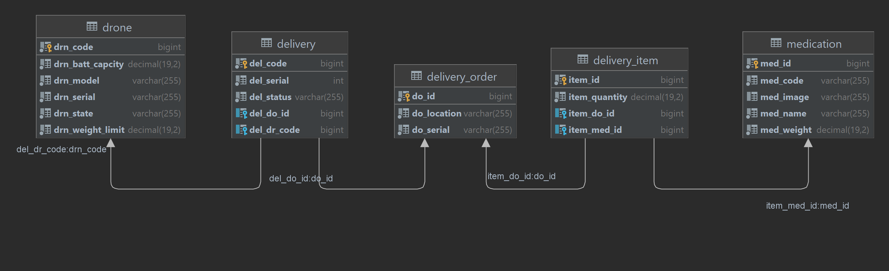

# Medispatch
Medispatch is a drone management application for dispatching and delivering of medication items.
## Features
- Drone registration
- Load drone with medication items;
- Check loaded medication items for a given drone;
- Check available drones for loading;
- Check drone battery level for a given drone;
## Design




## Requirements
* Springboot Framework
* Docker
## Dependencies
There are a number of third-party dependencies used in the project.
* spring-boot-starter-web
* spring-boot-starter-data-jpa
* mysql-connector-java
* logback-core
* spring-boot-starter-aop

## Database
It uses a MySql database running in a docker container. This can be changed easily in the applications.yml file for any other database.
## Run Locally

Clone the project

```bash
  git clone https://github.com/gitneo/medispach.git
```

Go to the project directory

```bash
  cd ogo-okafor
```

Build

```bash
  mvn clean install
```

Start the server

```bash
  docker-compose up
```


## Rest API
The REST API to the Medispatch app is decribed below
### Registering a Drone
#### Request
```
POST localhost:8080/medispatch/api/v1/drone
```
#### Response
```
Content-Type: application/json
Transfer-Encoding: chunked
Date: Wed, 03 Aug 2022 23:27:57 GMT
Keep-Alive: timeout=60
Connection: keep-alive

{"id":2,"serialNo":"BETADRONE-12","model":"CRUISERWEIGHT","weightLimit":500,"batteryCapacity":100,"state":"IDLE","deliveryList":[]}
```

## Loading a Drone with medication items
#### Request
```
POST http://localhost:8080/medispatch/api/v1/delivery/8
```
#### Response
```
Content-Type: application/json
Transfer-Encoding: chunked
Date: Wed, 03 Aug 2022 23:43:12 GMT
Keep-Alive: timeout=60
Connection: keep-alive

{"id":2,"serial":-1591359585,"status":"READY","droneId":6,"deliveryOrderId":8}
```
## Checking loaded medication items for a given Drone
#### Request
```
GET http://localhost:8080/medispatch/api/v1/drone/items/1
```
#### Response
```
Content-Type: application/json
Transfer-Encoding: chunked
Date: Thu, 04 Aug 2022 09:43:45 GMT
Keep-Alive: timeout=60
Connection: keep-alive

[{"med_id":1,"med_image":"xxxxxx","med_name":"CrystalMeth","med_weight":600.00,"med_code":"MED_0020"}]
```
## Checking available drones for loading
#### Request
```
GET http://localhost:8080/medispatch/api/v1/drone/idle
```
#### Response
```
Content-Type: application/json
Transfer-Encoding: chunked
Date: Thu, 04 Aug 2022 19:43:47 GMT
Keep-Alive: timeout=60
Connection: keep-alive

[{"id":8,"serialNo":"BETADRONE-18","model":"CRUISERWEIGHT","weightLimit":500.00,"batteryCapacity":100.00,"state":"IDLE","deliveryList":[]}]
```

## Checking Drone battery level
#### Request
```
GET http://localhost:8080/medispatch/api/v1/drone/battery/1
```
#### Response
```
Content-Type: application/json
Transfer-Encoding: chunked
Date: Thu, 04 Aug 2022 19:52:32 GMT
Keep-Alive: timeout=60
Connection: keep-alive

100
```
